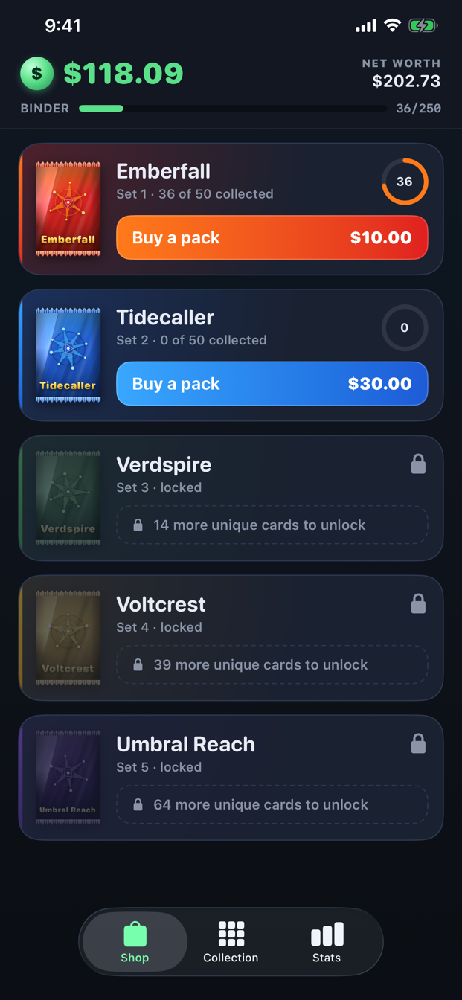
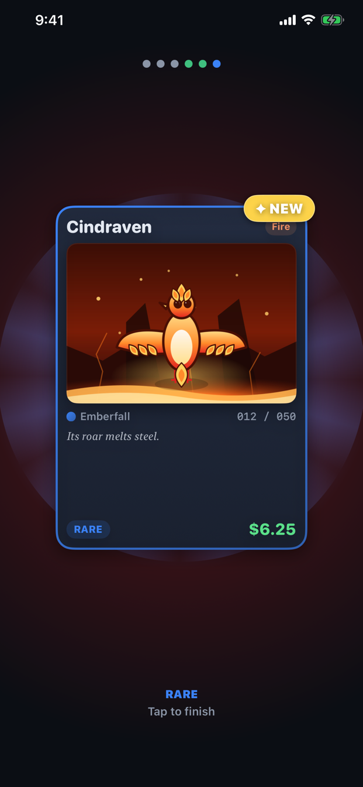
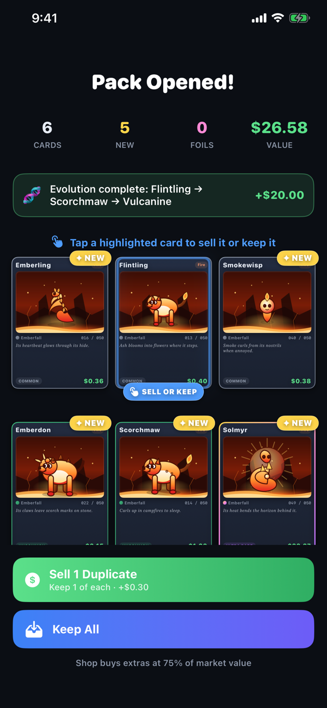
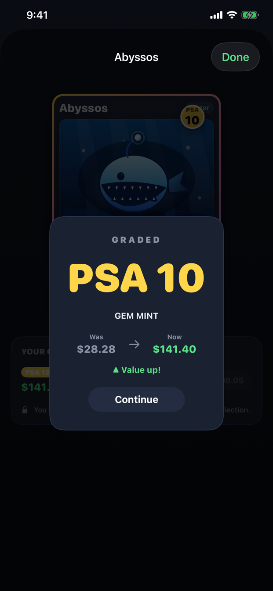
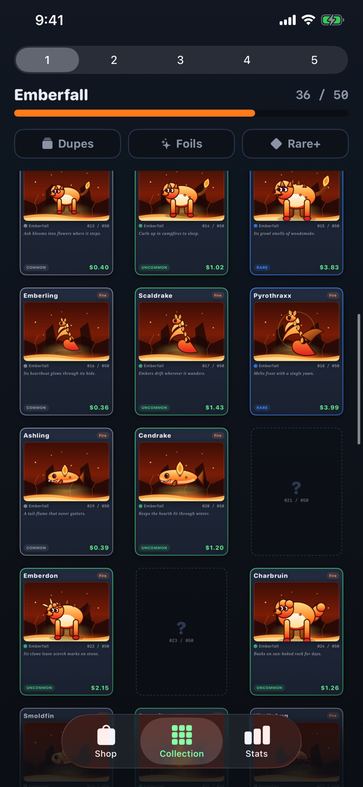

<div align="center">


# Trading Up

### Rip packs, chase the rares.

**Start with $100. Finish with all 250 Sprytes.**

A card‑collecting economy game for iPhone and iPad, built in SwiftUI.

[](#requirements)
[](https://developer.apple.com/xcode/swiftui/)
[](#no-catches)
[](https://github.com/CallMeGreg/trading-up/actions/workflows/ci.yml)

</div>

---

## Overview

Trading Up is built around the best part of trading cards: tearing open a fresh
pack and turning it over one card at a time.

Buy a pack, rip it, and find out what you got. Six cards — three commons, two
uncommons, and a rare or an ultra rare — with a 1% shot at a shimmering foil on
any of them. New pulls go straight into your binder. Extras become cash, at the
shop's price rather than yours.

Between those two ends is a real economy — pack odds, a buylist spread, grading
variance and set bonuses — that you can actually play against instead of just
watching. Collect all **250 Sprytes** and you're a Master Collector. Run out of
cash with nothing left worth selling and you're tapped out.

Every creature, name, illustration and line of flavor text is original to the
game, generated from code and shipped inside the app. No accounts, no ads, no
in‑app purchases, no internet connection.

## Screenshots

<table>
<tr>
<td width="20%"></td>
<td width="20%"></td>
<td width="20%"></td>
<td width="20%"></td>
<td width="20%"></td>
</tr>
<tr>
<td align="center"><b>Shop</b></td>
<td align="center"><b>Rip packs</b></td>
<td align="center"><b>Keep or sell</b></td>
<td align="center"><b>Grade</b></td>
<td align="center"><b>Collect</b></td>
</tr>
</table>

<sub>Real screenshots from the current build, captured on an iPhone by
<a href="docs/APP_STORE.md#screenshots"><code>tools/capture_screenshots.sh</code></a>.</sub>

## How to play

### 🛒 Buy a pack

Each of the five sets sells a **Pack** of 6 cards. Higher sets cost steeply more —
$10 → $30 → $75 → $160 → $400 — but hold far more valuable cards, so working your
way up is the only route to the expensive half of the collection.

### ✨ Rip it

Tap to reveal cards one at a time, with the hit slot always saved for last. Every
pack is **3 commons, 2 uncommons, and 1 rare‑or‑ultra**, and every card has a
**1% chance** to be a shiny **foil** (×3 value).

### 🗂️ Keep or sell

On the pack summary, brand‑new cards are flagged **✦ NEW**. Tap any duplicate to
keep or sell it individually, or use **Sell Duplicates** / **Keep All** at the
bottom — the sell total updates live as you decide each card.

The shop buys at a **buylist spread**: you get **75%** of a card's market value.
Churning packs and dumping dupes slowly bleeds money, and that spread is the
game's main risk. You can **never sell your last copy** of a card, so your
collection is always safe.

### 🏅 Grade your best

Send a rare or ultra to grading for a flat per‑set fee ($2–$10) and roll a PSA
grade. A **PSA 10** is ×5, a **PSA 9** is ×2, and a **PSA 1** is a freak ×10
jackpot — but grades 2–7 are worth *less* than ungraded. Because the fee is cheap
next to a pricey card, grading valuable duplicates **before** you sell them is a
real edge. Grading and foils stack.

### 📖 Complete the binder

Browse all 50 cards per set. Owned cards show off your best copy; unowned cards
are locked silhouettes. Filter the grid by **Dupes**, **Foils** and **Rare+**, and
combine filters to narrow further. Completing an **evolution line** pays a cash
bonus; completing a whole **set** pays a big one (15× the pack price).

### 🏆 Win or go broke

**Win** by collecting all 250 cards. **Lose** if your cash drops below $10 — the
cheapest pack — with no way to raise it, even by selling every duplicate you own.
Winning is a celebration, not an ending: dismiss the win screen and your completed
collection stays yours to browse. Starting over is always an explicit, confirmed
choice.

Your progress **auto‑saves** after every action, and a save is never silently
discarded.

## Five sets, 250 cards

| # | Set | Theme | Pack price |
|---|-----|-------|-----------:|
| 1 | **Emberfall** | Fire / magma | $10 |
| 2 | **Tidecaller** | Water / ice | $30 |
| 3 | **Verdspire** | Grass / nature | $75 |
| 4 | **Voltcrest** | Electric / storm | $160 |
| 5 | **Umbral Reach** | Shadow / cosmic | $400 |

Each set is 50 cards with its own creatures, evolution lines, flavor text and
rarity spread, and unlocks as your collection grows.

## No catches

- **No in‑app purchases and no real money, ever.** The only currency is the
  fictional one inside the game.
- **No ads.**
- **No account, no sign‑in, no internet connection required.**
- **No data collected.** Your collection lives in a single file on your device
  and is never sent anywhere.
- **Plays entirely offline**, on both iPhone and iPad.

## Build it from source

### Requirements

macOS with **Xcode 16+** and an **iOS 17+ Simulator**. That's it — the app has
**zero third‑party dependencies** and all 250 cards are embedded in the binary.

### Run it

```bash
git clone https://github.com/CallMeGreg/trading-up.git
cd trading-up
xed .            # or double-click TradingUp.xcodeproj
```

Pick a simulator in the scheme selector and press **▶︎ Run** (`⌘R`). You start
with $100 — open the **Shop** tab, buy a pack, and tap to reveal.

Full instructions, project layout and the content generators are in
[docs/DEVELOPMENT.md](docs/DEVELOPMENT.md).

## Documentation

| Doc | What's in it |
| --- | --- |
| [Design](docs/DESIGN.md) | The full game design document: the world, the sets, the economy and grading tables, win/lose rules |
| [Development](docs/DEVELOPMENT.md) | Build and run, project layout, regenerating cards, art, icon and sound |
| [Testing](docs/TESTING.md) | The unit test suite, the Foundation‑only simulation harness, and CI |
| [App Store](docs/APP_STORE.md) | Producing submission artifacts, and the full listing metadata |

## Credits

Created by [@CallMeGreg](https://github.com/CallMeGreg). All 250 creatures, their
names, artwork and flavor text are original works created for this app; no
third‑party or licensed content is used.
