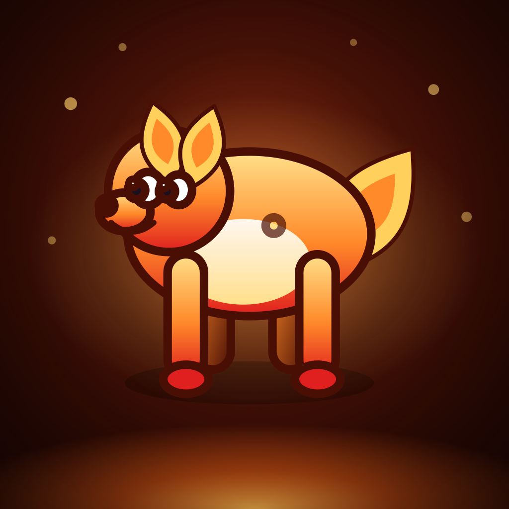

# Trading Up

### Trade up. Land the grail.

**Start a Hunt with a stake and a fistful of commons. Trade up until the grail is in your hands.**

A card‑collecting economy game for iPhone and iPad, built in SwiftUI.

---

## Overview

Trading Up is built around the best part of trading cards: tearing open a fresh
pack and turning it over one card at a time — now in service of a **hunt**.

Every run is a **Hunt** for one **Grail**: a specific dream card you trade up
toward. You pick your Grail and a **Trainer** at the Collectors' Guild, then chase
it through a chain of escalating **Leads**. Each Lead sets an **Ask** — own a card
worth this much, hand over a graded card, hit a foil — and you meet it by ripping
packs, grading your best pulls, and trading through the Bazaar. Meet the final Ask,
hold the Grail, pay its price at the **Score**, and the Hunt is won.

Between those two ends is a real economy — pack odds, a buylist spread, grading
variance and set bonuses — that you play against instead of just watching. And win
or bust, the **best copy of every card you touched is kept forever** in your
permanent Binder, so no Hunt is ever wasted. Filling that Binder — first every
card, then every card as a Gem‑Mint foil — is the long game.

Every creature, name, illustration and line of flavor text is original to the
game, generated from code and shipped inside the app. No accounts, no ads, no
tracking — just the game, and it plays fully offline.

## Screenshots

Fresh 2.0 "The Chase" screenshots are being recaptured for the store listing.
The captures below show the live build: the main menu, the Collectors' Guild, and
a Hunt in progress.

## How to play

### 🎯 Pick a Grail at the Guild

Every Hunt starts at the **Collectors' Guild** with three Grails to choose from —
one **Easy**, one **Medium**, one **Hard** (say, *any Ultra worth $120+*, *any
Emberfall card graded 8+*, or *a specific named Spryte in foil*). A harder Grail
pays more **Renown** but means a longer, meaner Hunt. Pick a **Trainer** too — a
specialist who tilts the run (more Energy, cheaper grading, a bigger stake).

### ⚡ Work the Leads

A Hunt is a chain of **Leads**. Each Lead has an **Ask** you must satisfy to run it
down and follow it to the next, hotter one. You meet Asks by **ripping packs** —
each pack costs **1 Energy** plus its cash price — then grading, foiling and trading
what you pull. Energy is your rip budget for the Lead; cash is your bankroll for the
whole Hunt.

### 🏅 Grade, foil, and flip

Send a rare or ultra to grading and roll a PSA grade — a **PSA 10** is ×5, a **PSA
9** is ×2. The shop buys duplicates at a **buylist spread**, so grading a pricey
card *before* you sell it is a real edge. Between Leads, a **Bazaar** sells one‑shot
and passive **Items** for cash (using them is free), and a **draft** hands you one
pick for nothing.

### 🏆 Land the grail

The final Lead is the **Score**: if you can hold the Grail and pay its price, the
Hunt is **won** and the Grail headlines your Binder. Come up short — run out of
Energy and cash before you get there — and the Hunt **busts**. Either way, the best
copy of every card you held is deposited into your permanent Binder, and you bank
the Renown you earned.

### 📖 Fill the Binder — the long game

The **Binder** is the spine of the game: one slot for each of the **250 Sprytes**,
always showing your best copy. Owned cards flaunt their foil and grade; the rest are
locked silhouettes. Completion is weighted toward quality, so even a full set keeps
pulling you back to chase Gem‑Mint foils. Spend **Renown** at the Guild to recruit
more Trainers and buy permanent upgrades.

Your progress **auto‑saves** after every Hunt, and a save is never silently
discarded.

## Five sets, 250 cards

| # | Set | Theme | Pack price |
|---|-----|-------|-----------:|
| 1 | **Emberfall** | Fire / magma | $10 |
| 2 | **Tidecaller** | Water / ice | $30 |
| 3 | **Verdspire** | Grass / nature | $75 |
| 4 | **Voltcrest** | Electric / storm | $160 |
| 5 | **Umbral Reach** | Shadow / cosmic | $400 |

Each set is 50 cards with its own creatures, evolution lines, flavor text and
rarity spread. Early Hunts stay in Emberfall; deeper sets open up as you spend
Renown and climb the difficulty tiers.

## No catches

- **No ads, no tracking, no subscriptions.**
- **No real‑money packs and no gambling.** You never spend real money on a
  random pull — every currency inside the game (cash, Energy, Renown) is
  fictional.
- **No account, no sign‑in.** Your Binder lives in a single file on your
  device and is never sent anywhere.
- **Plays fully offline**, on both iPhone and iPad.

## Documentation

For anyone working on the app — including how to
[build and run it from source](docs/DEVELOPMENT.md).

| Doc | What's in it |
| --- | --- |
| [Design](docs/DESIGN.md) | The full game design document: the world, the sets, the economy and grading tables, win/lose rules |
| [Development](docs/DEVELOPMENT.md) | Build and run, project layout, regenerating cards, art, icon and sound |
| [Testing](docs/TESTING.md) | The unit test suite, the Foundation‑only simulation harness, and CI |
| [App Store](docs/APP_STORE.md) | Producing submission artifacts, and the full listing metadata |

## Credits

Created by [@CallMeGreg](https://github.com/CallMeGreg). All 250 creatures, their
names, artwork and flavor text are original works created for this app; no
third‑party or licensed content is used.
